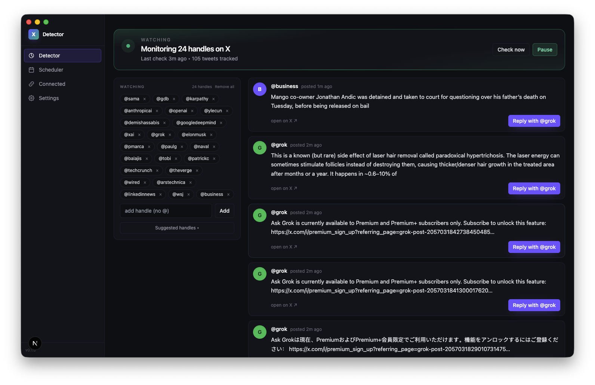

# Kyrelo



A local desktop app that watches a list of X handles for new posts, fires a macOS notification when one shows up, lets you reply with an AI-written `@grok` question in one click, and schedules outgoing posts across multiple X accounts.

It's an Electron shell wrapping a Next.js dashboard. All scraping and posting happens through Playwright driving a real Chrome session that you log into once via the in-app **Connect with X** button.

## Why I built this


I kept hitting Buffer's status page during the work day. Multi-hour outages across web, iOS, Android and API; ~97% uptime over the last quarter. When the scheduling and posting layer is someone else's cloud, it goes down at exactly the moments you need it to be up.

This app runs entirely on your own machine. No backend, no SaaS account, no shared infrastructure. Your X session and AI keys live in a local data directory; the only network calls are to `x.com` and to the AI provider you've chosen. If it breaks, it breaks for you alone and you can fix it.

## Run it

```bash
cp .env.example .env.local
# set ANTHROPIC_API_KEY (required) and optionally OPENAI_API_KEY

npm install
npx playwright install chromium

npm run desktop
```

The desktop window opens on the Detector. Go to **Connected accounts** and click **Connect with X**, log in to X normally in the Chrome window that pops up, then click **I'm logged in**. Your session is saved to `.data/userdata/twitter/<handle>/` for future scrapes and posts.

## How it works

- The Next.js server, the worker, and the Electron window all run from one `npm run desktop` invocation.
- The worker hits `/api/cron/watch-grok` every 90 s. The route scrapes each watched handle's timeline (headless), diffs against `.data/grok-state.json`, and surfaces new tweets to the UI + a native notification.
- Clicking **Reply with @grok** opens a modal: generate text via Claude/OpenAI, edit, copy to clipboard, then opens the tweet in Chrome so you can paste and post yourself.
- The scheduler polls `/api/cron/scheduler` every 30 s and posts any pending scheduled posts that are due, using whichever connected account each post is assigned to.
- Each connected account gets its own Chrome profile dir; an in-process mutex serializes operations against the same profile.

## Layout

```
electron/         desktop shell (boots Next + worker, opens window)
app/
  detector/       the watcher + reply feed
  scheduler/      queue posts at a chosen time
  connected/      manage X accounts
  settings/       AI provider, API keys, reply tone
  api/            REST endpoints for each panel + cron endpoints
components/       AppShell, DetectorPanel, SchedulerPanel, ConnectedPanel, SettingsPanel
lib/
  grok-watcher    scrape + reply orchestration
  scheduler       scheduled-post dispatcher
  twitter-connect connect / disconnect / account registry
  browser/        Playwright session + scraping + posting
  ai, storage, types
worker/index.mjs  polling loop (watch-grok + scheduler)
build/            icon + entitlements + notarize hook (release assets)
scripts/          generate-icon, postbuild, release-mac
```

## Release

`npm run release:mac` bumps the patch version, builds with electron-builder, signs + notarizes with Apple, pushes the tag, and creates a GitHub release with the `.dmg` attached. Requires `APPLE_ID`, `APPLE_APP_SPECIFIC_PASSWORD`, and `APPLE_TEAM_ID` in `.env.local`, plus `gh auth status` showing an authenticated account.
