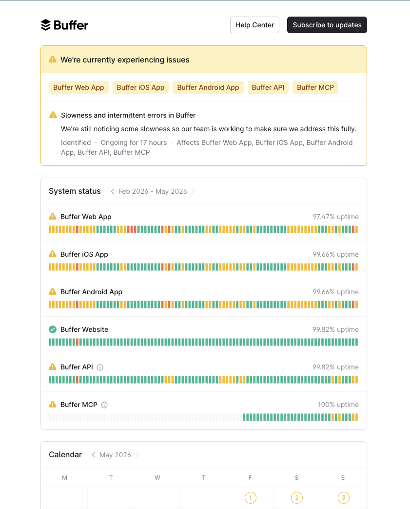

# Kyrelo — Community Driven Buffer Alternative

A local desktop app and marketing site for **Kyrelo** — the open-source, community-driven Buffer alternative for X.

**Website:** [kyrelo.com](https://kyrelo.com/)
**Download the app here:** [GitHub Releases](https://github.com/sobytes/Kyrelo-Buffer-Alternative/releases/)


## Why?



Buffer's status page is a working-day fixture. Multi-hour outages, ~97% uptime over the last quarter. When the scheduling layer is someone else's cloud, it breaks at exactly the moments you need it up.

Kyrelo runs entirely on your machine. No backend, no SaaS account, no shared infrastructure.

## Repo layout

| Folder | What it is |
|---|---|
| [`desktop/`](./desktop) | The Electron + Next.js + Playwright app. Schedule X posts, watch handles, generate AI replies. Built for macOS first. |
| [`website/`](./website) | The marketing site at [kyrelo.com](https://kyrelo.com). Plain Next.js + Tailwind, deploys to Vercel with **Root Directory = `website`**. |

## Quick start

### Desktop app

```bash
cd desktop
cp .env.example .env.local      # set ANTHROPIC_API_KEY
npm install
npx playwright install chromium
npm run desktop
```

See [`desktop/`](./desktop) for the full guide, release process, and architecture.

### Website

```bash
cd website
npm install
npm run dev                     # http://localhost:3001
```
